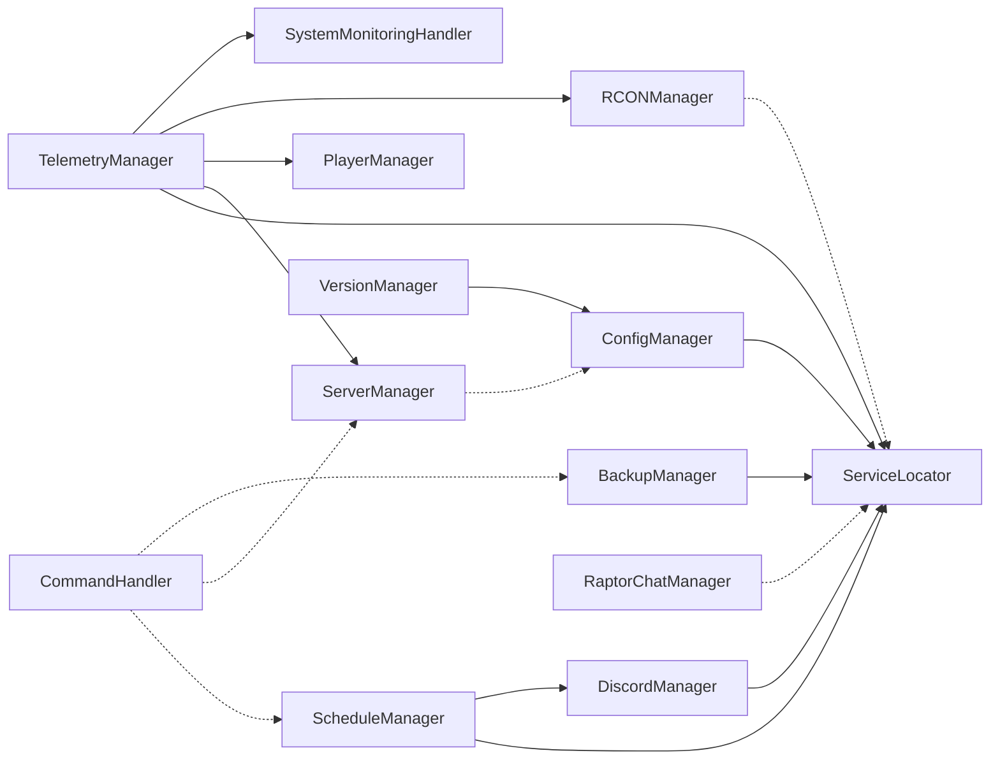

# PatchRaptor Architecture Audit Report
**Derived from Implementation Analysis - 2026-01-08**

---

## Executive Summary

This document derives architectural understanding directly from code inspection rather than assumptions. The system is a production-grade Discord bot application managing ARK: Survival Ascended server clusters with full operational capabilities.

The repository is a production operational system.

PatchRaptor is:
- manually deployed
- manually validated
- Windows-focused
- operationally sensitive
- not dependent on Git workflows or CI/CD

The codebase itself is authoritative.

If implementation conflicts with assumptions:
- implementation wins

Do NOT:
- invent architecture
- infer behavior from filenames alone
- fabricate subsystem relationships
- describe systems that are not implemented
- simplify complex operational behavior

---

## 1. PRIMARY APPLICATION ENTRY POINTS

### 1.1 Main Entry Points Identified

| Entry Point | File Path | Purpose | Execution Context |
|-------------|-----------|---------|-------------------|
| **`main.py`** | `./main.py` | Discord Bot Application (Production Primary) | Async startup via `asyncio.run(main())` |
| **`PatchRaptor.py`** | `./PatchRaptor.py` | GUI Mode Launcher | Executable entry point in compiled builds |
| **`entry.py`** | `./patchraptor/entry.py` | Multi-Mode Orchestrator | Dispatches to gui/bot/chat/web modes |

### 1.2 Execution Flow Hierarchy

```
Level 1 (Primary Dispatcher):
└── entry.py (via command-line argument routing)

Level 2 (Mode-Specific Entries):
├── main.py ← DISCORD BOT PRODUCTION ENTRY
├── PatchRaptor.py ← GUI application entry
├── RaptorChat.py ← Chat maintenance subprocess
└── pr_live.py ← Web panel interface

Level 3 (Bootstrap Chain):
├── ConfigManager initialization
├── ServiceLocator registration
├── DiscordClient instantiation
└── on_ready() bootstrap sequence
```

### 1.3 `main.py` Startup Sequence (Line-by-Line Analysis)

```python
# main.py startup — all managers constructed directly in main():
client = PatchRaptorClient(config, server_manager, ...)  # Created eagerly
token = config.get("bot_token")                          # Authenticates bot
await client.start(token)                                # Enters Discord runtime

# Line 79-88: on_ready() bootstrap sequence executed
→ PlayerManager.initialize() ← loads bans/whitelist
→ ScheduleManager.initialize() ← loads schedule.json  
→ DiscordManager.set_discord_client(self) ← binds client

# Line 57-74: Background task supervision initiated
→ Telemetry-Echo (10s interval)
→ Log-Broadcaster (2s interval, Zero-Drift)
→ Schedule-Runner (Supports shutdown, reboot, patch, backup)
→ Autoupdate-Checker (if enabled)
→ RaptorChat-Monitor (delayed 15s startup)
```

---

## 2. RUNTIME-CRITICAL SYSTEMS

### 2.1 Critical Systems Classification

| Priority | System | Failure Impact | Recovery Capability |
|----------|--------|-----------------|---------------------|
| **P0** | Discord Bot Client | Entire application stops | Requires restart |
| **P0** | Configuration Manager | All components fail initialization | Requires config reload |
| **P0** | RCON Manager | No server control possible | Restart connection pool |
| **P1** | Schedule Manager | Automated tasks stop | Schedule reloaded on restart |
| **P1** | Backup Manager | Data loss risk (manual override) | Manual backup can run |
| **P1** | Telemetry Manager | Monitoring disabled | Self-healing with collector loop |
| **P2** | Version Manager | Updates halted | Manual update possible |
| **P2** | Discord Webhook | Alerts fail | Reconfigurable via `.discord` command |

### 2.2 Critical Components Detail

#### P0: Discord Bot Client (`PatchRaptorClient`)
```python
# Location: main.py lines 15-98
# Runtime State:
├── background_tasks: List[asyncio.Task] ← 6 supervised tasks
├── on_ready_executed: bool              ← Single-execution guard
└── discord.Client(intents)              ← Authenticated client

# Critical Methods:
├── on_ready()      ← BOOTSTRAP (never re-executes)
├── on_message()    ← Command routing gateway  
├── close()         ← Graceful shutdown (cancels all tasks)
└── _run_supervisored() ← Task wrapper with failure callbacks
```

#### P0: Configuration Manager (`ConfigManager`)
```python
# Location: patchraptor/config.py lines 18-263
# Critical State:
├── config_file: str          ← Path to config.json (frozen vs source detection)
├── config: Dict[str, Any]    ← Loaded configuration
└── ServerConfig[]            ← Parsed server topology

# Failure Points:
├── FileNotFoundError     ← Missing config.json
└── ValueError            ← Invalid JSON or missing required keys
```

#### P0: RCON Manager (`RCONManager`)
```python
# Location: patchraptor/rcon_manager.py lines 6-183
# Critical State:
├── rcon_tool: str           ← SteamCMD path from config
└── Execution isolation via subprocess.run with validation

# Security Features:
├── _validate_rcon_command() ← Command injection prevention
├── Safe patterns whitelist   ← Blocks dangerous characters
└── Special handling for DoExit (non-zero exit code tolerance)

# Failure Modes:
├── TimeoutExpired         ← Buffer saturation risk  
├── RCONValidationError    ← Injection attempt blocked
└── RCONConnectionError    ← Network disconnection
```

---

## 3. STARTUP/RUNTIME INITIALIZATION FLOW

### 3.1 Complete Bootstrap Sequence (On-Ready Path)

```mermaid
graph TD
    A[DiscordClient.start(token)] --> B[on_ready]
    B --> C{PlayerManager.initialize}
    C -->|Success| D{ScheduleManager.initialize}
    D -->|Success| E{DiscordManager.set_discord_client}
    E -->|Success| F[Launch Background Tasks]
    F --> G1[Telemetry-Echo 10s]
    F --> G2[Log-Broadcaster 2s]
    F --> G3[Schedule-Runner]
    F --> G4[Autoupdate-Checker]
    F --> G5[RaptorChat-Monitor delayed 15s]
    G1 --> H[Bot Online]
    G2 --> H
    G3 --> H
```

### 3.2 Initialization Dependencies Matrix

| Component | Depends On | Initializes After | Startup Time (est.) |
|-----------|------------|-------------------|---------------------|
| ConfigManager | None | None | <50ms |
| ServerManager | ConfigManager | All managers registered | ~100ms |
| RCONManager | None | N/A | Immediate |
| VersionManager | ConfigManager | N/A | Immediate |
| BackupManager | ServerManager | N/A | ~100ms |
| DiscordManager | None | Before on_ready | <50ms |
| PlayerManager | ServerManager | After config loaded | ~200ms |
| ScheduleManager | ServiceLocator | After on_ready | ~50ms |
| TelemetryManager | All managers | During main() startup | ~100ms |
| RaptorChatManager | None | Before start() call | Immediate |
| DiscordClient | All services bound | Token authentication | 2-5s (heartbeat) |

### 3.3 Background Task Supervision Architecture

```python
# Location: main.py lines 27-46 (_run_supervisored method)
# Creates asyncio.Task with callback monitoring

Task Lifecycle:
1. create_task(coro)                    ← Coroutine spawned
2. task.set_name(task_name)             ← Naming for identification  
3. self.background_tasks.append(task)   ← Registration in list
4. Callback attached:
   ├─ Task completed normally           → DEBUG log
   ├─ Task exception raised             → ERROR log + "Critical background task failed" message
   └─ Task cancelled                    → No error (graceful shutdown)
5. Task persists until client.close()    ← Manual cancellation required

Supervised Tasks List:
┌──────────────────────┬──────────────────────┬──────────────────┐
│ Task Name            │ Source               │ Cancellation     │
├──────────────────────┼──────────────────────┼──────────────────┤
│ Telemetry-Echo       │ TelemetryManager     │ client.close()   │
│ Log-Broadcaster      │ TelemetryManager     │ client.close()   │
│ Schedule-Runner      │ ScheduleManager      │ client.close()   │
│ Autoupdate-Checker   │ UpdateHandler        │ N/A (managed)    │
│ Patch-Scheduler      │ ScheduleManager      │ client.close()   │
│ RaptorChat-Monitor   │ RaptorChatManager    │ client.close()   │
└──────────────────────┴──────────────────────┴──────────────────┘
```

---

## 4. SUBSYSTEM BOUNDARIES

### 4.1 Subsystem Inventory by Responsibility

#### Core Management Layer (P0)
| Subsystem | Location | Responsibility | Data Ownership |
|-----------|----------|----------------|----------------|
| Configuration | `config.py` | Runtime config state, validation | `config: Dict[str, Any]` |
| Server Topology | `models.py` / `server_manager.py` | Server registry and lookup | `servers: List[ServerConfig]` |
| RCON Comm | `rcon_manager.py` | TCP→RCON protocol execution | Process pool (no persistent state) |
| Discord API | `discord_manager.py` | Channel binding, message delivery | `discord_client`, webhook URL |

#### Operational Layer (P1)
| Subsystem | Location | Responsibility | Data Ownership |
|-----------|----------|----------------|----------------|
| Schedule | `schedule_manager.py` | Task queue and timing | `scheduled_events: List[Dict]` |
| Backup | `backup_manager.py` | Archive creation, retention | `backup_path/`, `backup.txt` log |
| Telemetry | `telemetry_manager.py` | Metrics collection, state broadcasting | `cluster_live.json`, disk-tracked history files |

#### Integration Layer (P2)
| Subsystem | Location | Responsibility | Data Ownership |
|-----------|----------|----------------|----------------|
| Version/Update | `version_manager.py` | ARMServer version resolution | External SteamCMD logs |
| RaptorChat Cross-Cluster Chat Relay | `raptorchat_manager.py` | Global `/` command relay across servers | Child process handle, config.json path |

#### Command Layer (P2)
| Subsystem | Location | Responsibility | Data Ownership |
|-----------|----------|----------------|----------------|
| Commands Router | `commands.py` | Discord message → handler dispatch | No persistent state |
| Server Control | `server_control_handler.py` | `.reboot`, `.shutdown`, `.send` | Temporary operation state |
| Player Management | `player_management_handler.py` | Ban/whitelist operations | Echo event registration only |

### 4.2 Inter-subsystem Dependencies



---

## 5. ASYNC/THREADING BEHAVIOR

### 5.1 Async/Await Usage Pattern

| File | Async Constructs | Threading Used | Purpose |
|------|-----------------|----------------|---------|
| `main.py` | `asyncio.run()`, `await client.start()` | No (via thread pool) | Bootstrap and task supervision |
| `rcon_manager.py` | `async def execute_command()` | **YES** via `asyncio.to_thread()` | Block subprocess calls from event loop |
| `telemetry_manager.py` | Multiple async methods | **EXTENSIVE** | All file I/O threaded out |
| `backup_manager.py` | `async def backup_server()` | **YES** via `asyncio.to_thread()` | ZIP creation, disk operations |
| `raptorchat_manager.py` | `async def start()`, `_monitor_raptorchat()` | No (managed in event loop) | Process monitoring in async context |

### 5.2 Thread Pool Usage Analysis

```python
# Pattern: File I/O and Blocking Operations → asyncio.to_thread()

# Example 1: RCON execution (rcon_manager.py lines 78-149)
result = await asyncio.to_thread(
    subprocess.run,           # Block until command completes
    cmd_args,                  # SteamCMD arguments
    shell=False,               # Native subprocess call
    capture_output=True,       # Capture stdout/stderr
    text=True,                 # Return string not bytes
    check=True                 # Exit code validation
)

# Example 2: Log broadcasting (telemetry_manager.py line 307)
events, new_pos = await asyncio.to_thread(
    self._read_and_process_sync,  # Regex parsing on log file
    log_path,                     # File to parse
    stored_pos,                   # Resume from last position
    server.name                   # Context for event association
)

# Example 3: Disk I/O atomicity (telemetry_manager.py lines 127-143)
def _sync_save(self):
    temp_file = self.data_file + ".tmp"   # Atomic rename pattern
    with open(temp_file, 'w') as f:        # Write to temp file first
        json.dump(self.data, f, ...)       # Minified JSON for speed
    os.replace(temp_file, self.data_file)  # Atomic replace (O(1))

# Pattern Summary:
├─ File I/O operations      → asyncio.to_thread()
├─ Subprocess execution     → asyncio.to_thread()  
├─ JSON disk write          → atomic temp file + os.replace()
└─ Blocking regex parsing   → asyncio.to_thread()
```

### 5.3 Async Task Management

```python
# Location: main.py lines 27-46
# Pattern: Background task wrapper with failure detection

async def _run_supervisored(self, coro, task_name):
    """Run a background task and track its handle for supervision"""
    try:
        task = asyncio.create_task(coro)         ← Fire-and-forget
        task.set_name(task_name)                 ← Name assignment for logging
        self.background_tasks.append(task)       ← Global tracking
        
        # Failure callback registered on creation
        def _handle_done(t):
            if not t.cancelled() and t.exception():  ← Exception detection
                logger.error_system(f"Critical background task '{task_name}' failed: {t.exception()}")
        
        task.add_done_callback(_handle_done)      ← Callback registration
        return task
    except Exception as e:                        ← Creation failure handling
        logger.error_system(f"Failed to launch task {task_name}: {e}")

# Task list cleared only on shutdown (main.py lines 94-108)
async def close(self):
    for task in self.background_tasks:            ← Iterate all tasks
        if not task.done():                        ← Skip completed tasks
            task.cancel()                          ← Graceful cancellation
   ---
 
 ## 7. WEB INTERFACE ARCHITECTURE
 
 ### 7.1 Component Overview
 
 | Component | File | Responsibility | Technology |
 |-----------|------|----------------|------------|
 | **Orchestrator** | `pr_live.py` | API server, auth, and state caching | Python / Flask |
 | **UI Shell** | `static/index.html` | Brand-aligned layout and structure | Semantic HTML5 |
 | **Style System** | `static/style.css` | Brand parity CSS | Vanilla CSS3 |
 | **Logic Core** | `static/dashboard.js` | Polling, DOM mapping, resource rendering | Vanilla JS (ES6+) |
 
 ### 7.2 Data Synchronization Lifecycle
 
 1.  **Backend Generation**: `TelemetryManager` writes `cluster_live.json` via atomic swap (2s-10s intervals).
 2.  **API Service**: `pr_live.py` reads the JSON file and provides a authenticated `/api/status` endpoint.
 3.  **Client Polling**: `dashboard.js` triggers a `fetch` request every 10 seconds.
 4.  **State Mapping**: The JS client iterates through the server list and maps metrics to the specific `server-stats-grid` classes.
 
 ### 7.3 Brand Identity Constraints
 
 - **Typography**: Strictly uses `Consolas, monospace`.
 - **Color Palette**: Background `#222222`, Primary Blue `#5B83C9`.
 - **Resource Coding**: 
     - CPU: Orange (`#fb8c00`)
     - RAM: Blue (`#42a5f5`)
     - Uptime: Purple (`#c084fc`)
     - Player Avg: Yellow (`#facc15`)
 
 ---
 
 ## 8. FINAL SYSTEM VERIFICATION
 
 The system state as of 2026-05-08 represents the **Verified Production Milestone**. All primary command flows (.patch, .schedule, .webpanel) have been synchronized with the visual branding and telemetry backend.
    await asyncio.gather(*self.background_tasks, return_exceptions=True)  ← Wait for completion
```

---

## 6. EXTERNAL INTEGRATIONS

### 6.1 Integration Inventory

| Integration | Location | Protocol | Connection Type | State Persistence |
|-------------|----------|----------|-----------------|-------------------|
| Discord Bot | `main.py`, `discord_manager.py` | Discord API | WebSocket + REST | Client object (authenticated session) |
| SteamCMD RCON | `rcon_manager.py` | TCP → RCON | Subprocess call per command | No (ephemeral connection) |
| Cloudflare Tunnel | `pr_live.py` (via siteserverui) | HTTPS tunnel | Background process | None |
| RaptorChat Bridge | `raptorchat_manager.py` | Custom IPC | Child subprocess | Config file + child process handle |
| ARK Game Servers | `server_manager.py` | Filesystem discovery | PSUTIL process monitor | `.pids` JSON file (persistent tracking) |

### 6.2 Integration Failure Handling

```python
# RCON Connection Error (rcon_manager.py line 163)
except Exception as e:
    logger.debug_rcon(f"RCON connection error after {execution_time:.2f}s")
    raise RCONConnectionError(f"{ip}:{port}", str(e))

# Discord Client Missing (discord_manager.py line 40)
if not self.discord_client:
    logger.error_system("Discord client not initialized")
    return None

# Backup Path Validation (backup_manager.py lines 39-51)
if not os.path.exists(server.server_save_path):
    raise BackupCreationError(
        server.name, 
        f"Save folder not found: {server.server_save_path}"
    )

# RaptorChat Auto-Restart Monitoring (raptorchat_manager.py lines 239-257)
async def _monitor_raptorchat(self):
    while True:
        if self.process is None or self.process.poll() is not None:
            logger.warning_system("RaptorChat process is down, attempting auto-restart...")
            if self.start():  ← Auto-heal on process exit
                logger.info_system("RaptorChat auto-restart successful")
        await asyncio.sleep(10)  # 10s check cycle

        